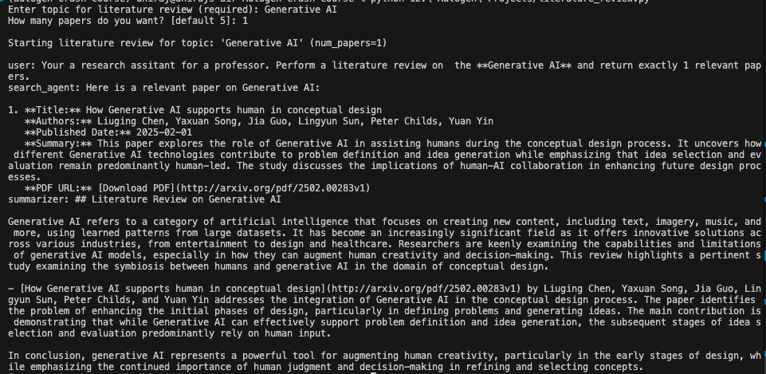

# 🤖 AutoGen-based Literature Review Assistant

An intelligent, multi-agent system built using [AutoGen](https://github.com/microsoft/autogen) to automate the academic literature review process. It performs real-time **arXiv searches** and generates structured **markdown summaries** of research papers using **LLM-powered collaboration**.

---

## What It Does

This system creates a **round-robin group chat** between autonomous AI agents:

- **Search Agent**
  - Transforms a user topic into a precise arXiv search query.
  - Uses a custom tool to retrieve up to 30 relevant papers.
  - Selects the top `N` results based on relevance.

- **Summarizer Agent**
  - Receives the selected papers in JSON format.
  - Generates a clean, human-readable **literature review** in Markdown.
  - Includes title, authors, the addressed problem, and key contributions.

---


## Upcoming Features

The system roadmap includes several enhancements to improve research quality, customization, and user experience:

- **Front-End Interface**
  - Launching a simple web-based UI for non-technical users.
  - Includes topic input, live search previews, and real-time summaries.
  - Markdown output viewer and export to PDF/LaTeX.

- **Quality Control Agent**
  - A new autonomous agent to review generated summaries.
  - Flags hallucinations, verifies citation consistency, and checks alignment with paper abstracts.

- **Citation-Based Filtering**
  - Optional filtering of papers based on citation count.
  - Users can prioritize highly cited works or recent impactful studies.

- **Multi-Source Paper Retrieval**
  - Extending beyond arXiv to include:
    - Semantic Scholar
    - PubMed
    - SpringerLink
    - Elsevier
  - Automatically chooses the most relevant sources per topic.


## 🧪 How to Run a Demo

To run the literature review assistant from the command line:

```bash
python literature_review.py



